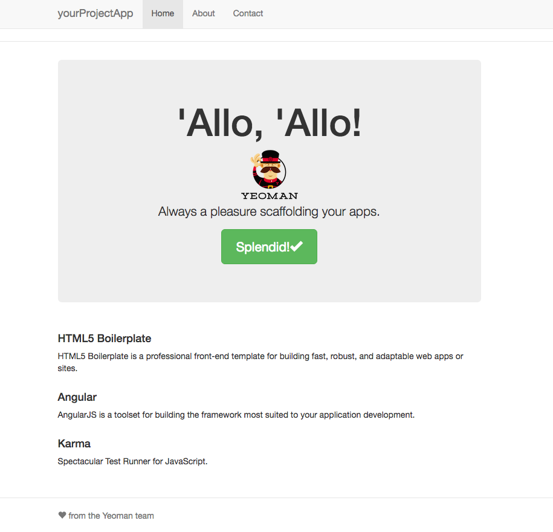

# Angular-deployment-tutorial
macOS, Yeoman, AngularJS 1.x, Grunt, Github, Heroku

**Purpose:** The purpose for writing this post is to share what I have learned over the three days (through trial and error) about using [Grunt](http://gruntjs.com). I hope that it’ll get you up and running within the hour. I will also be editing to this article as I learn more from the community and documentations.

**Context:** My team and I had seven days to learn enough about a new framework to build our final project at [Dev Bootcamp](http://devbootcamp.com), a coding bootcamp. We decided to use an AngularJS front-end that connected to our Rails API back-end. While it was easy to deploy our Rails API to Heroku, we were unsuccessful at deploying our front-end. Since we used [Yeoman](http://yeoman.io/) to scaffold our Angular template, the Yeoman system included Grunt. Grunt is essentially a task runner that automates tasks that you would do repeatedly. Since we had little time to learn about how Grunt worked, we did not successfully deploy our Web App to Heroku at the time. Since then, our Web App, UpLift, has been deployed to both Github pages and Heroku. The lesson that we learned is to deploy early and often. Here are the steps that I’ve compiled since that project. Think of this as building an Angular template Web App from scratch.

## Project goal:


Here is what the deployed result looks like on gh-pages:
[yourProjectApp](http://shinwang.us/Angular-deployment-tutorial/#/)

## Setup and steps on macOS:

I will use the **$** to represent the mac terminal prompt and **< >** as placeholder for your project's name.

* Install Node.js to your system by downloading [NodeJS](https://nodejs.org/en)
* To check if you already have a version of node:
```
$ node -v
```
* Since [node package manager](https://www.npmjs.com/) (npm) comes with the node install, all you’ll have to do is to do is to make sure that it’s up-to-date:
```
$ npm install npm -g
```
* To install Yeoman:
```
$ npm install -g yo
```
* To install the Angular generator:
```
$ npm install -g generator-angular
```
* Make your project folder and change into said project folder:
```
$ mkdir <your-project-name>-app && cd $_
```
* Track your files with Git
```
$ git init
```
* Add Github remote
```
$ git remote add origin <your-project-repo.git>
```
* Add, commit, and push to Github
* Inside your project folder:
```
$ yo angular <your-project-name>-app
```
* At this point, Yeoman will walk you through a basic setup prior to scaffolding your project. For my setup, I said **no** to Gulp, **no** to Sass/compass, and **yes** to Bootstrap. After that, I used the default Angular modules.
* If you wish to use [Karma](https://www.npmjs.com/package/grunt-karma) with Grunt to run tests:
```
$ npm install grunt-karma --save-dev
```
* To see what the scaffolded your-project-app looks like on your localhost, type:
```
$ grunt serve
```
* At this point, I would recommend that you spend some time looking through the **Gruntfile.js** in the **root of your project folder** to see all of the available tasks that you can type into your command line. For example, ```$ grunt test``` will run tests that you would write under the **test/spec** folder and ```$ grunt``` will minify (one of several tasks) a copied version of your files and place those files into a **dist** (distribution) folder. The advantage of having these automation task commands is that you can continuous build and test your Web App locally and deploy them quickly to check for matching functionality.

## Onto deployment

* Within your project folder:
```
$ npm install grunt-build-control --save-dev
```
* Then navigate to the [grunt-build-control](https://github.com/robwierzbowski/grunt-build-control) Github page, and use those instructions to complete your **Gruntfile.js**. I will outline what I’ve used here.
* Paste the following into your **Gruntfile.js**.
```
grunt.loadNpmTasks(‘grunt-build-control’);
```
* Next, refer to the **Usage** section on the grunt-build-control Github page and copy the example tasks into your **Gruntfile.js**. Below is my **Gruntfile.js** at this step of the tutorial. Do note that you’ll have to insert this block of tasks and make sure that each task is separated by a comma. This means that the task preceding ```buildcontrol: {…}``` would require a comma. I've indicated the two places insert code with ```///\```.
```
'use strict';

module.exports = function (grunt) {

  grunt.loadNpmTasks(‘grunt-build-control’);      ///\<---INSERT HERE
  var pkg = require('./package.json');          ///\<---INSERT HERE

  // Time how long tasks take. Can help when optimizing build times
  require('time-grunt')(grunt);

  // Automatically load required Grunt tasks
  require('jit-grunt')(grunt, {
    useminPrepare: 'grunt-usemin',
    ngtemplates: 'grunt-angular-templates',
    cdnify: 'grunt-google-cdn'
  });

  // Configurable paths for the application
  var appConfig = {
    app: require('./bower.json').appPath || 'app',
    dist: 'dist'
  };

  // Define the configuration for all the tasks
  grunt.initConfig({

    // Project settings
    yeoman: appConfig,

    ...// I've hidden the code in-between for brevity

    // Run some tasks in parallel to speed up the build process
    concurrent: {
      ...// I've hidden the code in-between for brevity
      dist: [
        'copy:styles',
        'imagemin',
        'svgmin'
      ]
    },   ///\ Don't forget the comma here, the code below is what I've copied over from grunt buildcontrol

    buildcontrol: {
      options: {
        dir: 'dist',
        commit: true,
        push: true,
        message: 'Built %sourceName% from commit %sourceCommit% on branch %sourceBranch%'
      },
      pages: {
        options: {
          remote: 'git@github.com:example_user/example_webapp.git',
          branch: 'gh-pages'
        }
      },
      heroku: {
        options: {
          remote: 'git@heroku.com:example-heroku-webapp-1988.git',
          branch: 'master',
          tag: pkg.version
        }
      },
      local: {
        options: {
          remote: '../',
          branch: 'build'
        }
      }
    }, ///\ Don't forget the comma here. The grunt buildcontrol pasted code stops here.

    // Test settings
    karma: {
      unit: {
        configFile: 'test/karma.conf.js',
        singleRun: true
      }
    }
  });


  grunt.registerTask('serve', 'Compile then start a connect web server', function (target) {
    ...// I've hidden the code in-between for brevity
  });

  ...// I've hidden the code in-between for brevity
};

```
* You will notice that the code block that you’ve just added has remote: ```'git@github.com:example_webapp.git’``` as the filler repository. You will need to manually change the ```example_webapp.git``` to your remote repository name on Github. Here is mine:
```
'git@github.com:Angular-deployment-tutorial.git'
```
* Add, commit, and push your project using Git.
* To create a distribution folder of your entire project, run:
```
$ grunt build
```
* You will notice that a dist folder has been created and is listed on your **.ignore** file. This folder will not be pushed to Github.
* To publish this project to your Github’s gh-pages, run:
```
$ grunt buildcontrol:pages
```
* A **gh-pages** branch will be created for you inside the dist folder.
* Congrats, you can now visit your deployed Angular template App on
```
http://<your-github-page-name>.github.io/<your-project-repo-name>
```
* If you wish to deploy this template App to Heroku, there will be a few more steps.

## Deployment to Heroku

* [Install Heroku Toolbelt](https://toolbelt.heroku.com/)
* Log into Heroku from your project directory
```
$ heroku login
Enter your Heroku credentials.
Email: you@example.com
Password (typing will be hidden):
Authentication successful.
```
* Create your Heroku App:
```
$ heroku create
Creating stark-fog-398... done, stack is cedar-14
http://stark-fog-398.herokuapp.com/ | https://git.heroku.com/stark-fog-398.git
Git remote heroku added
```
* In the example above, the App, ```stark-fog-398``` has been created on heroku. Your App will have a randomly generated name. Take this name and place it into your **Gruntfile.js**. Here is what I have:
```
heroku: {
        options: {
          remote: 'git@heroku.com:guarded-hamlet-26569.git', ///\INSERT App name
          branch: 'master',
          tag: pkg.version
        }
      },
```
* If you want to give your Heroku App a name, then type:
```
$ heroku create <your-project-app>
```
* Change into your dist directory and create the following files:
```
$ touch package.json server.js Procfile
```
* Copy over your the contents of your **package.json** file in your project root. Change the node versoin to **0.12.0** from **0.10.0**. Leave only the following:
```
{
  "name": "yourprojectapp",
  "engines": {
    "node": ">=0.12.0"
  },
  "scripts": {
    "test": "karma start test/karma.conf.js"
  }
}
```
* Inside the dist directory, install express:
```
$ npm install express --save
```
* Your **package.json** will now resemble this:
```
{
  "name": "yourprojectapp",
  "engines": {
    "node": ">=0.12.0"
  },
  "scripts": {
    "test": "karma start test/karma.conf.js"
  },
  "dependencies": {
    "express": "^4.14.0"
  }
}
```
* Create a simple express server inside the dist directory. Here is what my server.js looks like:
```
var express = require('express');

var app = express();

app.use(express.static(__dirname));

var port = process.env.PORT || 3000;

app.listen(port);
console.log('listening on ' + port);
```
* Heroku requires a Procfile to start the express server. Here is what my Procfile looks like:
```
web: node server.js
```
* Git add and commit changes for dist directory and project root directory.
* Push to Heroku using Grunt from the project root directory
```
$ grunt buildcontrol:heroku
```
* If all goes well, then congrats! You are now deployed on both gh-pages and Heroku.
* Here is my final result [yourProjectApp](https://guarded-hamlet-26569.herokuapp.com/#/)
* From here, as you continue to develop your App, you will have to run ```grunt``` to repackage your dist folder. Note that your **Package.json**, **server.js**, and **Procfile** will be deleted in the process. Be sure to copy their contents to a separate file in the root directory before running ```grunt``` from your project root. You will also have to ```npm install express`` from the dist directory.
* With anything, there's probably a better way to automate using Grunt. If would like to add anything, feel free to make a pull request.

Thanks!


